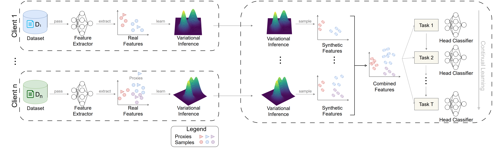

# VCL-FPFT: One-Shot Federated Class-Incremental Learning for Medical Imaging via Variational Feature Transfer

> **IJCAI 2026** — *One-Shot Federated Class-Incremental Learning for Medical Imaging via Variational Feature Transfer*
> Pedro H. Barros\*, Omid Orang\*, Giulia Zanon de Castro, Heitor S. Ramos, Frederico Gadelha Guimarães
> Future Lab, Department of Computer Science — Federal University of Minas Gerais (UFMG)
> \*Equal contribution

---

## Overview

**VCL-FPFT** (Variational Continual Learning for Federated Parametric Feature Transfer) is a one-shot federated continual learning framework for medical image classification. It enables multiple clients (e.g., hospitals) to collaboratively train a global model through a **single communication round**, while supporting **post-deployment class-incremental expansion** — all without sharing raw data.

Each client fits class-conditional variational Gaussian distributions over its local embeddings and transmits only the distribution parameters (mean µ, Cholesky factor L) to the server. The server aggregates these into a global mixture model, synthesizes features, and trains a classifier head — no raw data ever leaves the clients.

<p align="center">
  
</p>

### Key Properties

- **One-shot FL**: each client communicates with the server exactly once
- **Class-incremental CL**: the global label space expands over time after deployment
- **Privacy-preserving**: only variational parameters (µ, Σ) are transmitted, never raw samples
- **Model-heterogeneous**: clients may use different backbone architectures
- **Near-zero forgetting**: achieves ≤ 0.10% average forgetting across all evaluated settings

---

## Results at a Glance

| Dataset | Avg. Acc. (IID) | Avg. Acc. (α=0.3) | Forgetting |
|---|---|---|---|
| BloodMNIST | 97.71% | 97.16% | ≤ 0.05% |
| PathMNIST | 97.29% | 96.75% | ≤ 0.01% |
| OCTMNIST | 86.10% | 85.20% | ≤ 0.10% |
| TissueMNIST | 81.37% | 77.78% | ≤ 0.09% |

On OCTMNIST and PathMNIST (3-task setting), VCL-FPFT achieves **97.13%** and **97.32%** average accuracy respectively, outperforming all regularization, expansion, generative, and prior federated CL baselines.

---

## Installation

```bash
git clone https://github.com/Omid-Orang/one-shot-FL-VCL.git
cd one-shot-FL-VCL

# Create a virtual environment (recommended)
python -m venv venv
source venv/bin/activate  # Windows: venv\Scripts\activate

pip install -r requirements.txt
```

### Dependencies

- Python ≥ 3.9
- PyTorch ≥ 2.0
- torchvision
- [Pyro](https://pyro.ai/) (`pyro-ppl`)
- medmnist
- scikit-learn
- tqdm
- matplotlib
- numpy

---

## Quick Start

Run the full pipeline (local training → one-shot aggregation → continual evaluation) with default settings:

```bash
python FL_mobileatten_VI_CL.py
```

This uses `TissueMNIST` with 5 clients, Dirichlet non-IID partitioning (α=0.3), 4 tasks, and diagonal VI fitting.

---

## Configuration

All hyperparameters are consolidated at the top of `FL_mobileatten_VI_CL.py`. The most relevant options are:

### Dataset & Federation

| Parameter | Default | Description |
|---|---|---|
| `DATASET` | `"tissuemnist"` | MedMNIST dataset name. Options: `tissuemnist`, `pathmnist`, `organamnist`, `organsmnist` |
| `NUM_CLIENTS` | `5` | Number of federated clients |
| `ALPHA` | `0.3` | Dirichlet concentration for non-IID partitioning (lower = more skewed) |
| `PARTITION_MODE` | `"dirichlet"` | Data partitioning strategy: `"dirichlet"`, `"iid_uniform"`, `"iid_stratified"` |

### Model & Embedding

| Parameter | Default | Description |
|---|---|---|
| `EMBED_DIM` | `128` | Embedding dimension for the feature extractor |
| `BACKBONE_TRAINABLE` | `True` | Whether to fine-tune the MobileNetV2 backbone |
| `EPOCHS_EMB` | `8` | Number of local training epochs per client |
| `LR_EMB` | `3e-4` | Learning rate for backbone parameters |
| `TEMP_PROXY` | `0.6` | Temperature for the Proxy-NCA loss |

### Variational Inference

| Parameter | Default | Description |
|---|---|---|
| `FIT_MODE` | `"vi_diag"` | VI fitting mode: `"vi_diag"` (diagonal Gaussian via Pyro) or `"moments"` (empirical full-rank covariance) |
| `NUM_SVI_STEPS` | `1500` | Number of SVI optimization steps (used when `FIT_MODE="vi_diag"`) |
| `SVI_LR` | `1e-3` | Learning rate for Pyro SVI optimizer |

### Server-Side Synthesis & Classifier

| Parameter | Default | Description |
|---|---|---|
| `PER_CLASS_SYNTH` | `8000` | Number of synthetic features generated per class |
| `PRIOR_MIX_BETA` | `0.1` | Mixing weight between empirical and uniform class prior |
| `HEAD_EPOCHS` | `30` | Training epochs for the cosine classifier head |
| `HEAD_LR` | `1e-3` | Learning rate for the classifier head |
| `COS_S` | `14.0` | Cosine head temperature scale |

### Continual Learning

| Parameter | Default | Description |
|---|---|---|
| `USE_CONTINUAL_FED` | `True` | Enable/disable continual class-incremental evaluation |
| `NUM_TASKS` | `4` | Number of class-incremental tasks |

---

## How It Works

The pipeline proceeds in three stages:

**1. Local Client Training**
Each client independently trains a MobileNetV2 + self-attention feature extractor using a variational Proxy-NCA loss. Batch normalization layers are frozen to mitigate client drift under non-IID distributions. Each class is represented as a Gaussian variational proxy q(µ) = N(µ_c, Σ_c).

**2. One-Shot Server Aggregation**
Clients transmit only their variational parameters (µ, L, sample counts) — no raw data. The server constructs a per-class Gaussian mixture:

$$q^{\text{global}}_c(\mathbf{z}) = \sum_{k \in \mathcal{K}_c} \pi_{k,c}\, \mathcal{N}(\mathbf{z} \mid \mu_{k,c}, \Sigma_{k,c})$$

where mixture weights π are proportional to each client's sample count for that class. Synthetic features are then sampled from this mixture and used to train a cosine classifier head.

**3. Post-Deployment Class-Incremental Learning**
When new classes arrive, the server samples synthetic replay embeddings from stored past-class mixtures alongside embeddings for the new classes. A new classifier head is trained using a combined cross-entropy + knowledge distillation objective, preserving performance on old classes without accessing any historical client data.

---

## Supported Datasets

The code supports the following [MedMNIST](https://medmnist.com/) datasets out of the box:

| Dataset | Classes | Modality |
|---|---|---|
| TissueMNIST | 8 | Microscopy |
| PathMNIST | 9 | Colon Pathology |
| OrganAMNIST | 11 | Abdominal CT |
| OrganSMNIST | 11 | Abdominal CT |
| BloodMNIST | 8 | Blood Cell Microscopy |
| OCTMNIST | 4 | Retinal OCT |
| DermaMNIST | 7 | Dermatoscopy |

To add a new dataset, extend the `build_medmnist()` function with the corresponding MedMNIST class.

---

## Project Structure

```
one-shot-FL-VCL/
├── FL_mobileatten_VI_CL.py   # Main pipeline: all models, training, and evaluation
├── requirements.txt
├── data/                     # Auto-downloaded MedMNIST datasets
├── assets/                   # Figures for README
└── README.md
```

### Main Components (inside `FL_mobileatten_VI_CL.py`)

| Component | Description |
|---|---|
| `MobileNetAttentionEmbedder` | MobileNetV2 backbone with self-attention pooling |
| `ProxyNCALoss` | Variational Proxy-NCA loss with learnable class proxies |
| `DirichletPartitioner` | Non-IID data partitioning via Dirichlet(α) |
| `IIDUniformPartitioner` / `IIDStratifiedPartitioner` | IID data partitioning strategies |
| `fit_feature_gaussians_vi_diag` | Pyro SVI-based diagonal Gaussian fitting per class |
| `fit_feature_gaussians_fullrank` | Empirical full-rank covariance fitting with shrinkage |
| `make_synth_loader_weighted` | Weighted synthetic feature sampler from Gaussian mixtures |
| `CosineHead` | Cosine similarity classifier head |
| `run_continual_heads` | Class-incremental head training with synthetic replay + KD |
| `main()` | Full federated one-shot + continual evaluation loop |

---

## Citation

If you find this work useful, please cite:

```bibtex
@inproceedings{barros2026vclFPFT,
  title     = {One-Shot Federated Class-Incremental Learning for Medical Imaging via Variational Feature Transfer},
  author    = {Barros, Pedro H. and Orang, Omid and de Castro, Giulia Zanon and Ramos, Heitor S. and Guimar{\~a}es, Frederico Gadelha},
  booktitle = {Proceedings of the Thirty-Fifth International Joint Conference on Artificial Intelligence (IJCAI)},
  year      = {2026}
}
```

---

## Acknowledgements

This work was supported by CNPq (Grant no. 304856/2025-8, "Collaborative Machine Learning and Privacy Protection") and CAPES through PROEX. It is also partially funded by the UFMG–Fundep R&D&I agreement on Federated Machine Learning for Connected Vehicles, and by Kunumi and Embrapii (Project PDCC-2412.0030).

---

## License

This project is released under the [MIT License](LICENSE).
